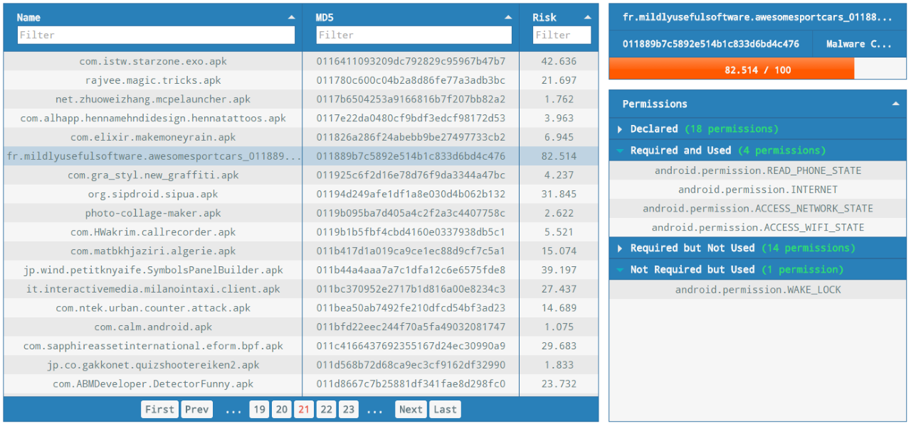

# RiskInDroid

> A tool for quantitative risk analysis of Android apps based on machine learning techniques.

[](https://www.codacy.com/app/ClaudiuGeorgiu/RiskInDroid)
[](http://www.python.org/download/releases/3.5.2/)
[](http://scikit-learn.org/)

**RiskInDroid** (**Ri**sk **In**dex for An**droid**) is a tool for quantitative risk analysis of Android applications written in Java (used to check the permissions of the apps) and Python (used to compute a risk value based on apps' permissions). The tool uses classification techniques through *scikit-learn*, a machine learning library for Python, in order to generate a numeric risk value between 0 and 100 for a given app. In particular, the following classifiers of *scikit-learn* are used in **RiskInDroid** (this list is chosen after extensive empirical assessments):
* Support Vector Machines (SVM)
* Multinomial Naive Bayes (MNB)
* Gradient Boosting (GB)
* Logistic Regression (LR)

Unlike other tools, **RiskInDroid** does not take into consideration only the permissions declared into the app manifest, but carries out reverse engineering on the apps to retrieve the bytecode and then infers (through static analysis) which permissions are actually used and which not, extracting in this way 4 sets of permissions for every analyzed app:
* Declared permissions - extracted from the app manifest
* Exploited permissions - declared and actually used in the bytecode
* Ghost permissions - not declared but with usages in the bytecode
* Useless permissions - declared but never used in the bytecode

From the above sets of permissions (and considering only the official list of Android permissions), feature vectors (made by `0`s and `1`s) are built and given to the classifiers, which then compute a risk value. The precision and the reliability of **RiskInDroid** have been empirically tested on a dataset made of more than 6K malware samples and 112K apps.

### Publication

More details about **RiskInDroid** can be found in the paper "[RiskInDroid: Machine Learning-based Risk Analysis on Android](https://github.com/ClaudiuGeorgiu/RiskInDroid/blob/master/RiskInDroid_paper.pdf)" ([official pubblication link](https://link.springer.com/chapter/10.1007/978-3-319-58469-0_36)). You can cite the paper as follows:

> A. Merlo, G.C. Georgiu. "RiskInDroid: Machine Learning-based Risk Analysis on Android", in *Proceedings of the 32nd International Conference on ICT Systems Security and Privacy Protection* ([IFIP-SEC 2017](http://www.ifipsec.org/)).

```TeX
@Inbook{RiskInDroid,
  author="Merlo, Alessio and Georgiu, Gabriel Claudiu",
  editor="De Capitani di Vimercati, Sabrina and Martinelli, Fabio",
  title="RiskInDroid: Machine Learning-Based Risk Analysis on Android",
  bookTitle="ICT Systems Security and Privacy Protection: 32nd IFIP TC 11 International Conference, SEC 2017, Rome, Italy, May 29-31, 2017, Proceedings",
  year="2017",
  publisher="Springer International Publishing",
  pages="538--552",
  isbn="978-3-319-58469-0",
  doi="10.1007/978-3-319-58469-0_36",
  url="https://doi.org/10.1007/978-3-319-58469-0_36"
}
```

### Demo

If you want to quickly see the tool in action, visit [https://www.riskindroid.com](https://www.riskindroid.com) to browse the full experimental results and calculate the risk of other apps, otherwise continue reading for instructions on how to install it on your own computer. Below you can see a screenshot of the live demo of **RiskInDroid**:




## Usage

There are two ways of getting a working copy of **RiskInDroid** on your own computer: either by using Docker or by using a `Python 3.5` environment. In both cases, the first thing to do is to get a local copy of this repository, so open up a terminal in the directory where you want to save the project and clone the repository:

```Shell
# This could take quite a lot of time since the repository contains a 25 MB compressed database
$ git clone https://github.com/ClaudiuGeorgiu/RiskInDroid.git
$ cd RiskInDroid
```

#### Using Docker

This is the suggested way of using **RiskInDroid**, since the only requirement is to have Docker installed. Make sure to execute the following commands in the previously created `RiskInDroid` directory (the folder containing the `Dockerfile`):

```Shell
# This will take some time, since a lot of things have to be downloaded
$ docker build -t riskindroid .
$ docker run -p 8080:80 riskindroid
# Now open http://localhost:8080/ in your browser
```

The live demo at [https://www.riskindroid.com](https://www.riskindroid.com) is just a Docker container deployed with the following command:

```Shell
$ docker run -d --restart=always -p 80:80 -p 443:443 -v "$PWD/app/upload":/var/www/app/upload/ riskindroid
```

#### Using Python

This method was tested and works on Ubuntu 16.04. `Python 3.5` and Java must be installed on your computer, optionally you can install `p7zip-full` in order to extract the database archive automatically, but this can also be done manually by using any other compatible tool to extract the content of `RiskInDroid/app/database/permission_db.7z` in the `RiskInDroid/app/database` directory. Make sure to execute the following commands in the previously created `RiskInDroid` directory:

```Shell
# If not using virtualenv (https://virtualenv.pypa.io/), skip the next 2 lines
$ virtualenv -p python3 venv
$ source venv/bin/activate

# Install RiskInDroid requirements
$ pip3 install -r requirements.txt

# Run RiskInDroid
$ python3 app/app.py
# Now open http://localhost:5000/ in your browser
```


## Contributing

Questions, bug reports and pull requests are welcome on GitHub at [https://github.com/ClaudiuGeorgiu/RiskInDroid](https://github.com/ClaudiuGeorgiu/RiskInDroid).


## License

With the exception of [PermissionChecker.jar](https://github.com/ClaudiuGeorgiu/RiskInDroid/blob/master/app/PermissionChecker.jar), you are free to use this code under the [MIT License](https://github.com/ClaudiuGeorgiu/RiskInDroid/blob/master/LICENSE).

[PermissionChecker.jar](https://github.com/ClaudiuGeorgiu/RiskInDroid/blob/master/app/PermissionChecker.jar) belongs to [Talos srls](http://www.talos-sec.com/) and you can use it "AS IS" with RiskInDroid, for research purposes only.
